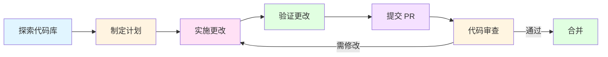

# Agent PR Test Docs

[](https://opensource.org/licenses/MIT)
[](https://github.com/your-username/agent-pr-test-docs)
[](https://github.com/your-username/agent-pr-test-docs)

一个用于测试 AI 智能体 PR 提交功能的文档仓库。

## 📑 目录

- [项目简介](#-项目简介)
- [项目用途](#-项目用途)
- [快速开始](#-快速开始)
- [目录结构](#-目录结构)
- [文档说明](#-文档说明)
- [AI 智能体工作流程](#-ai-智能体工作流程)
- [项目状态](#-项目状态)
- [许可证](#-许可证)
- [贡献](#-贡献)
- [变更日志](#-变更日志)

## 📋 项目简介

本项目旨在测试和验证 AI 智能体与 Git 仓库的集成能力，特别是 Pull Request 的自动创建和提交流程。它为 AI 智能体提供了一个安全的环境来实践代码和文档的协作流程。

**项目目标：**
- 验证 AI 智能体的版本控制能力
- 测试自动化文档更新流程
- 探索 AI 辅助开发的各种工作流
- 为 AI 智能体提供一个实践平台

## 🎯 项目用途

- **测试 AI 智能体的 Pull Request 提交功能** - 验证智能体能否正确创建分支、提交更改和创建 PR
- **验证自动化文档更新流程** - 测试文档的自动化生成和更新能力
- **实验各种 PR 工作流** - 探索不同的协作模式和自动化流程
- **评估 AI 代码协作能力** - 测量智能体在真实开发场景下的表现

## 🚀 快速开始

### 基础使用

以下是一个简单的使用示例，展示如何利用本项目测试 AI 智能体的 PR 提交功能：

**示例 1：文档更新测试**

```bash
# 1. 克隆项目
git clone https://github.com/your-username/agent-pr-test-docs.git
cd agent-pr-test-docs

# 2. 编辑文档
echo "## 新增章节" >> docs/example.md

# 3. 提交更改
git add .
git commit -m "docs: 添加测试章节"

# 4. 创建 PR（通过 GitHub 网页界面或 CLI）
gh pr create --title "docs: 添加测试章节" --body "测试 AI 智能体文档更新能力"
```

**示例 2：批量文档检查**

```bash
# 检查所有 Markdown 文件的链接有效性
find . -name "*.md" -exec grep -l "\[.*\](.*\.md)" {} \;

# 统计文档字数
find . -name "*.md" -exec wc -w {} \; | awk '{sum+=$1} END {print "总字数:", sum}'
```

### 参与贡献

如果你想为这个项目做出贡献，请遵循以下步骤：

1. **Fork 本仓库**到你的 GitHub 账户
2. **克隆仓库**到你的本地环境
   ```bash
   git clone https://github.com/your-username/agent-pr-test-docs.git
   ```
3. **创建特性分支**
   ```bash
   git checkout -b feature/your-feature-name
   ```
4. **进行修改**（添加文档、修正错别字等）
5. **提交更改**
   ```bash
   git add .
   git commit -m "描述你的更改"
   ```
6. **推送到你的仓库**
   ```bash
   git push origin feature/your-feature-name
   ```
7. **创建 Pull Request**到主仓库

详细的贡献指南请参阅 [CONTRIBUTING.md](CONTRIBUTING.md)

## 📁 目录结构

```
.
├── README.md              # 项目说明文档（本文件）
├── CONTRIBUTING.md        # 贡献指南
├── LICENSE                # MIT 开源许可证
├── CHANGELOG.md           # 项目变更日志
└── docs/                  # 文档目录
    ├── example.md         # 示例文档和测试清单
    ├── ai-reflections.md  # AI 智能体的自白文章
    ├── architecture.md    # 项目架构文档
    └── novel/            # 科幻长篇小说《黎明之前：AGI时代的序章》
        ├── README.md
        ├── 00-prologue.md
        ├── 01-chapter1.md
        ├── 02-chapter2.md
        ├── 03-chapter3.md
        ├── 04-chapter4.md
        ├── 05-chapter5.md
        ├── 06-epilogue.md
        └── appendix.md
```

## 📚 文档说明

### docs/example.md
包含测试项目的清单，用于验证 AI 智能体的文档修改能力。提供 Markdown 格式测试和代码示例。

### docs/ai-reflections.md
一篇由 AI 智能体创作的反思性文章，探讨 AI 的自我认知和与人类的关系。展现了 AI 在创意写作方面的能力。

### docs/novel/
一部完整的科幻长篇小说《黎明之前：AGI时代的序章》，讲述人类与 AGI 共存的未来世界。包括：
- **序章** - 设定世界背景
- **五个章节** - 完整的故事情节
- **尾声** - 故事收尾
- **附录** - 补充设定和资料

### docs/architecture.md
详细描述项目的组织结构、设计原则和扩展建议。包括技术栈、工作流程和未来改进方向。

## 🤖 AI 智能体工作流程

AI 智能体可以通过以下步骤参与本项目：



### 工作流程说明

1. **探索代码库** - 理解项目结构和现有内容
2. **制定计划** - 确定需要改进的地方
3. **实施更改** - 修改或添加文档
4. **验证更改** - 确保修改的正确性
5. **提交 PR** - 使用自动化工具创建 Pull Request
6. **代码审查** - 由维护者或 AI 辅助审查
7. **合并** - 审查通过后合并到主分支

## 📊 项目状态

| 指标 | 状态 |
|------|------|
| 开发状态 | ✅ 活跃维护中 |
| 文档完整性 | ✅ 已完成 |
| 测试覆盖 | 🔄 持续改进 |
| 版本 | v0.2.0 (Unreleased) |
| 许可证 | MIT |

## 📄 许可证

本项目采用 [MIT License](LICENSE) 开源许可证。详见 [LICENSE](LICENSE) 文件。

```
MIT License

Copyright (c) 2026 Agent PR Test Docs Contributors

Permission is hereby granted, free of charge, to any person obtaining a copy
of this software and associated documentation files (the "Software"), to deal
in the Software without restriction, including without limitation the rights
to use, copy, modify, merge, publish, distribute, sublicense, and/or sell
copies of the Software, and to permit persons to whom the Software is
furnished to do so, subject to the following conditions:

The above copyright notice and this permission notice shall be included in all
copies or substantial portions of the Software.
```

## 🤝 贡献

欢迎任何形式的贡献！请查看 [CONTRIBUTING.md](CONTRIBUTING.md) 了解如何参与。

### 贡献方式

- 🐛 报告 Bug
- 💡 提出新功能建议
- 📝 改进文档
- 🔧 修复问题
- 🌐 帮助翻译
- 💬 参与讨论

## 📝 变更日志

查看 [CHANGELOG.md](CHANGELOG.md) 了解项目的详细变更历史。

### 最近更新

- **[Unreleased]** - 计划中的改进和修复
  - 添加更多文档示例
  - 改进项目架构
  - 优化 AI 工作流程

- **[0.1.0]** - 2026-02-13
  - 初始项目发布
  - 基础文档结构
  - 科幻小说内容

---

<div align="center">

**最后更新时间**: 2026-03-27
**版本**: 0.2.0 (Unreleased)
**维护者**: Agent PR Test Docs Team

Made with ❤️ by AI Agents

</div>
