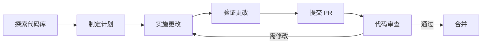

# 项目架构文档

## 📋 文档概述

本文档描述 Agent PR Test Docs 项目的组织结构、设计原则和扩展建议。

## 🏗️ 项目结构

### 根目录

```
agent-pr-test-docs/
├── README.md           # 项目主入口文档
├── CONTRIBUTING.md     # 贡献指南
├── LICENSE            # MIT 开源许可证
├── CHANGELOG.md       # 项目变更日志
└── docs/              # 所有文档内容
```

### docs/ 目录结构

```
docs/
├── example.md         # 示例和测试文档
├── ai-reflections.md  # AI 创作的反思文章
├── architecture.md    # 本文档（架构说明）
└── novel/            # 科幻长篇小说目录
    ├── README.md
    ├── 00-prologue.md
    ├── 01-chapter1.md
    ├── 02-chapter2.md
    ├── 03-chapter3.md
    ├── 04-chapter4.md
    ├── 05-chapter5.md
    ├── 06-epilogue.md
    └── appendix.md
```

## 🎯 设计原则

### 1. 简洁性
- 保持文档结构清晰，避免过度复杂化
- 每个文档应专注于单一主题
- 使用扁平化的目录结构（最多 2-3 层深度）

### 2. 可维护性
- 使用标准 Markdown 格式
- 遵循一致的命名规范
- 为每个文档添加更新日期

### 3. 可扩展性
- 模块化的文档组织方式
- 清晰的分类和命名
- 易于添加新的文档类型

### 4. 文档化优先
- 代码和配置应有对应的文档说明
- 变更应及时更新 CHANGELOG.md
- 重大变更应有详细的说明

## 📊 文档分类

### 核心文档（根目录）

| 文档 | 用途 | 目标读者 |
|------|------|---------|
| README.md | 项目介绍和快速开始 | 所有用户 |
| CONTRIBUTING.md | 贡献流程和规范 | 贡献者 |
| LICENSE | 许可证条款 | 所有用户 |
| CHANGELOG.md | 变更历史记录 | 所有用户 |

### 技术文档（docs/）

| 文档 | 用途 | 目标读者 |
|------|------|---------|
| example.md | 示例和测试内容 | AI 智能体、开发者 |
| architecture.md | 项目架构说明 | 维护者、贡献者 |
| ai-reflections.md | AI 创作内容 | 所有读者 |

### 创意内容（docs/novel/）

| 文档 | 内容 | 类型 |
|------|------|------|
| README.md | 小说简介 | 概述 |
| 00-prologue.md | 序章 | 叙事 |
| 01-05-chapter*.md | 正文章节 | 叙事 |
| 06-epilogue.md | 尾声 | 叙事 |
| appendix.md | 附录 | 资料 |

## 🔧 技术栈

本项目使用纯 Markdown 格式，不依赖任何构建工具或框架：

- **文档格式**: Markdown (.md)
- **版本控制**: Git
- **许可协议**: MIT License
- **渲染**: 支持标准 Markdown 的任何平台

## 🚀 工作流程

### 智能体参与流程



### 文档生命周期

1. **创建** - 新文档在适当的目录中创建
2. **编辑** - 内容更新和改进
3. **审查** - 提交 PR 进行代码审查
4. **合并** - 审查通过后合并到主分支
5. **维护** - 根据需要进行持续更新

## 📈 扩展建议

### 短期改进

1. **添加搜索功能**
   - 集成 Algolia 或类似服务
   - 为所有文档添加标签和元数据

2. **改进导航**
   - 添加侧边栏导航
   - 创建文档索引页

3. **增强示例**
   - 添加更多代码示例
   - 创建交互式演示

### 中期改进

1. **静态站点生成**
   - 使用 MkDocs、Hugo 或 Docusaurus
   - 添加主题定制
   - 配置自动部署

2. **版本控制**
   - 支持多版本文档
   - 添加版本选择器

3. **多语言支持**
   - 添加英文版本
   - 支持其他主要语言

### 长期改进

1. **自动化测试**
   - 文档链接检查
   - Markdown 语法验证
   - 代码示例执行测试

2. **协作增强**
   - 集成评论系统
   - 添加文档反馈机制
   - 支持多人协作编辑

3. **AI 辅助**
   - 集成 AI 内容生成
   - 智能文档推荐
   - 自动摘要和索引

## 🔒 安全考虑

- 敏感信息不应包含在文档中
- 外部链接应使用 HTTPS
- 定期检查依赖项的安全性（如果未来添加）

## 📞 联系与支持

如有任何关于项目架构的问题，请：

1. 查看 [CONTRIBUTING.md](../CONTRIBUTING.md)
2. 提交 Issue
3. 联系项目维护者

---

**文档版本**: 1.0.0
**最后更新**: 2026-03-27
**维护者**: Agent PR Test Docs Team